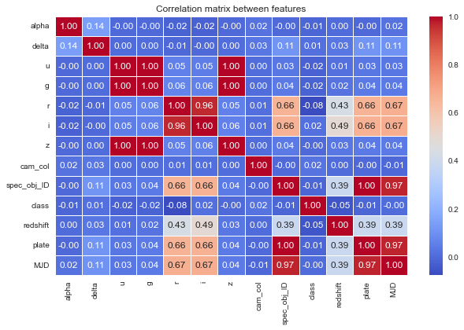

# Heavenly Bodies Classification with Machine Learning
The goal is to classify celestial objects (Galaxy, Star, QSO) based on photometric and spectroscopic features from the SDSS dataset. Includes full data preprocessing, class balancing using SMOTE, and performance analysis using accuracy, confusion matrix and class-wise metrics.

---

## 📚 Dataset

The project uses the [Stellar Classification Dataset - SDSS17](https://www.kaggle.com/datasets/fedesoriano/stellar-classification-dataset-sdss17/data), which contains **100,000 observations** from the Sloan Digital Sky Survey (SDSS).

Each sample describes a celestial object with photometric and spectroscopic features and assigns it to one of the following classes:
- **GALAXY**
- **STAR**
- **QSO (quasar)**

---

## 🧪 Exploratory Data Analysis (EDA)

### 📌 Data cleaning
- Removed irrelevant ID-based columns: `obj_ID`, `run_ID`, `rerun_ID`, `field_ID`, `fiber_ID`
- Converted class names into numerical values using `factorize()`:
  - Galaxy → 0
  - QSO → 1
  - Star → 2

### 📈 Class distribution

- The original dataset is **imbalanced**:
  - Galaxy: ~41,000 samples
  - Star: ~15,000 samples
  - QSO: ~13,000 samples
- Displayed as a pie chart using `matplotlib`


### 📊 Correlation Matrix

- Used `sns.heatmap()` to visualize Pearson correlations between features
- Observations:
  - Strong correlation among photometric features: `u`, `g`, `r`, `i`, `z`
  - ID-related columns (now removed) had no predictive value
  - Due to low correlation the following metadata was removed: `plate`, `MJD`, `cam_col`, `spec_obj_ID`
  - Some features like `alpha` and `delta` showed very weak correlation with class
  


### 📦 Feature selection

- Kept key physical features such as magnitudes and `redshift`
- Removed metadata and IDs
- Final features used for modeling: `[u, g, r, i, z, redshift, alpha, delta]`

---

## 📂 Repository structure

heavenly-bodies-classification\
│── data\
│ │── star_classification.csv\
│ \
│── src\
│ │── preprocessing.py\
│ │── modeling.py\
│ │── evaluation.py\
│\
│── main.py\
│── requirements.txt\
│── README.md

---

## 🚀 Installation

1. **Clone repository:**

   ```bash
   git clone https://github.com/t-piwowarski/heavenly-bodies-classification.git
   cd text-generator
   ```
2. **Create and activate a virtual environment (optional but recommended):**
   
- On Windows:
     
   ```bash
   python -m venv venv
   venv\Scripts\activate
   ```
   
- On Linux/macOS:
     
   ```bash
   python3 -m venv venv
   source venv/bin/activate
   ```
   
3. **Install the required packages:**
   
   ```bash
   pip install -r requirements.txt
   ```

4. **Run the main pipeline:**

   ```bash
   python main.py
   ```

   This will:

   - Load and clean the data
   - Scale and balance the features
   - Train KNN (on balanced data), Decision Tree and Random Forest (with class weights)
   - Show confusion matrices and full per-class evaluation

---

## 📊 Models & Techniques

  | Model           | Description |
  |:----------------:|:----------:|
  | KNN            | In order to balance the classes, the **GALAXY** set was undersampled, while the **STAR** and **QSO** sets were upsampled using `SMOTE`. The number of objects of each class in the training set was **25000**. The number N of nearest neighbors was '`k=15`. |
  | Decision Tree  | Trained on scaled, original data with `criterion=gini`, `class_weight=balanced`, `min_samples_split=2` |
  | Random Forest  | Trained on scaled, original data with `criterion=gini`, `class_weight=balanced`, `min_samples_split=2` |

---

## ✅ Results summary

### K-Nearest Neighbor Classification

  | Parameter | Galaxy | Star | QSO |
  |:---------:|:------:|:----:|:---:|
  | Recall | 0.9180 | 0.9054 | 0.9711 |
  | Accuracy | 0.9281 | 0.9703 | 0.9557 |
  | Precision | 0.9594 | 0.9359 | 0.8464 |
  | Specificity | 0.9430 | 0.9855 | 0.9514 |

  

  

### Decision Tree Classification

  | Parameter | Galaxy | Star | QSO |
  |:---------:|:------:|:----:|:---:|
  | Recall | 0.9734 | 0.9072 | 0.9954 |
  | Accuracy | 0.9657 | 0.9674 | 0.9981 |
  | Precision | 0.9690 | 0.9198 | 0.9960 |
  | Specificity | 0.9543 | 0.9815 | 0.9989 |

  

  

### Random Forrest Classification

  | Parameter | Galaxy | Star | QSO |
  |:---------:|:------:|:----:|:---:|
  | Recall | 0.9869 | 0.9186 | 0.9997 |
  | Accuracy | 0.9767 | 0.9784 | 0.9983 |
  | Precision | 0.9743 | 0.9658 | 0.9923 |
  | Specificity | 0.9619 | 0.9924 | 0.9979 |

  

  
